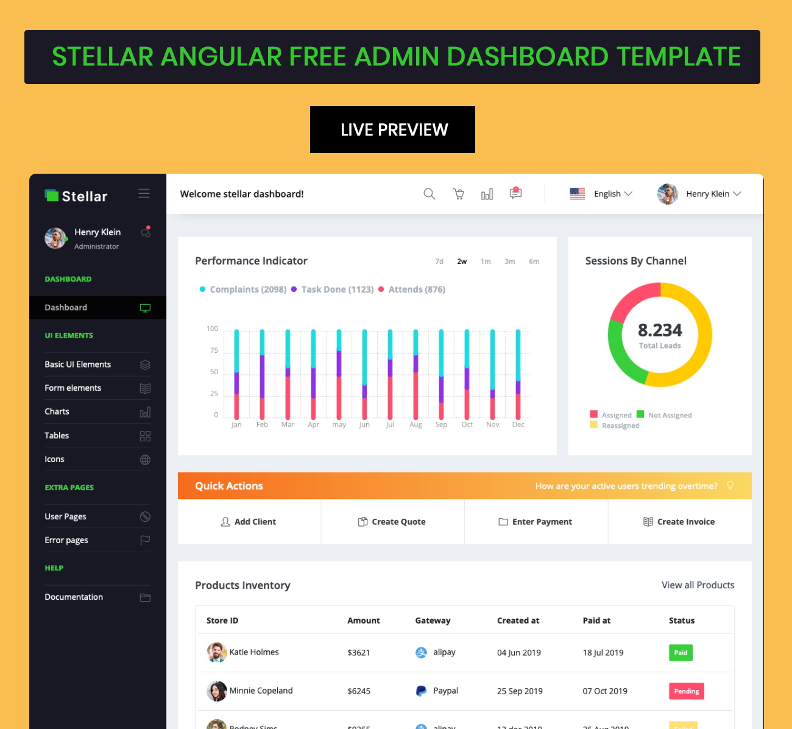

# Stellar Angular Free Admin Template

Stellar Angular is a great free-to-use admin template from BootstrapDash that combines simplicity and functionality. This feature-packed admin dashboard template is user friendly and highly customizable. Stellar Angular is available under MIT license, so feel free to use it in your projects however you want. This is a template that has been created with a lot of care and attention to detail. Check it out yourself to see what we’re talking about.

<h1>Demo</h1>
Click below to check out the live demo.

## What is included?

.Angular 10+ & Typescript
.Bootstrap 4+ & SCSS
.ng-bootstrap
.Responsive layout
And a lot more!

## Documentation
Click [here](http://bootstrapdash.com/demo/stellar-angular-free/documentation/documentation.html) to check out the documentation

### Need support?
Report your issues with as many details as you can provide and we’ll try to get back to you as soon as possible.

### More from BootstrapDash
Here are some of our most popular templates:

- [StarAdmin Free Bootstrap Admin Template](https://github.com/BootstrapDash/StarAdmin-Free-Bootstrap-Admin-Template)
- [PurpleAdmin Free Admin Template](https://github.com/BootstrapDash/PurpleAdmin-Free-Admin-Template)
- [MajesticAdmin Free Bootstrap Admin Template](https://github.com/BootstrapDash/MajesticAdmin-Free-Bootstrap-Admin-Template)
  
### Like what you see?
Please leave a star on our GitHub repo.
Submit bugs and help us improve Stellar Admin Vue!
Find us on [Twitter](https://twitter.com/bootstrapdash?lang=en), [Facebook](https://www.facebook.com/bootstrapdash/), [Instagram](https://www.instagram.com/bootstrapdash/?hl=en), [Behance](https://www.behance.net/bootstrapdash), [Pinterest](https://www.pinterest.com/bootstrapdash/), [Dribbble](https://dribbble.com/bootstrapdash), [LinkedIn](https://in.linkedin.com/in/bootstrapdash)

Meticulously built at BootstrapDash. We hope you ❤ Stellar Admin Vue!
### Additional Information

#### Development server
Run ng serve to run locally. Navigate to http://localhost:4200/. The app will automatically reload if you change any of the source files.

#### Code scaffolding
Run ng generate component component-name to generate a new component. You can also use ng generate directive|pipe|service|class|guard|interface|enum|module.

#### Build
Run ng build to build the project. The build artifacts will be stored in the dist/ directory. Use the --prod flag for a production build.

#### Running unit tests
Run ng test to execute the unit tests via Karma.

#### Running end-to-end tests
Run ng e2e to execute the end-to-end tests via Protractor.

#### Further help

To get more help on the Angular CLI use ng help or go check out the [Angular CLI README.](https://github.com/angular/angular-cli/blob/master/README.md).